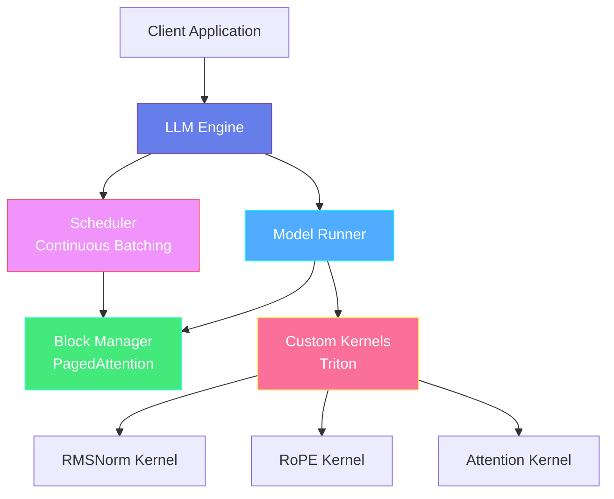
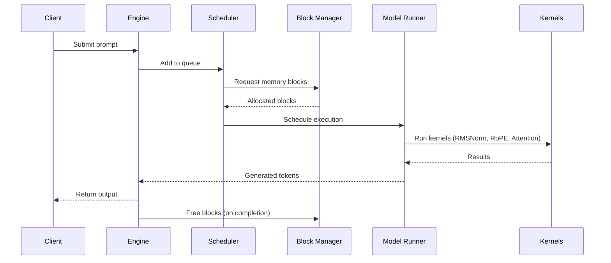

# Architecture Documentation | 架构文档

## Overview | 概述

Mini-Infer is a high-performance LLM inference engine designed to achieve 85-90% of vLLM's throughput while maintaining code clarity for learning purposes. The architecture is built around three core innovations: **PagedAttention** for memory management, **Custom Triton Kernels** for performance, and **Continuous Batching** for throughput optimization.

Mini-Infer是一个高性能LLM推理引擎，旨在达到vLLM 85-90%的吞吐量，同时保持代码清晰以便学习。架构围绕三个核心创新构建：**PagedAttention**用于内存管理，**自定义Triton内核**用于性能，以及**连续批处理**用于吞吐量优化。

---

## System Architecture | 系统架构



---

## Core Components | 核心组件

### 1. LLM Engine | 推理引擎

The main orchestrator that coordinates all components.

主要的协调器，协调所有组件。

**Responsibilities | 职责:**

- Request management and queueing
- Component initialization and lifecycle management
- Result aggregation and return

**Key Classes | 关键类:**

- `LLMEngine`: Main engine class
- `EngineConfig`: Configuration holder

---

### 2. Scheduler (Continuous Batching) | 调度器（连续批处理）

Dynamically schedules requests to maximize GPU utilization.

动态调度请求以最大化GPU利用率。

**Key Features | 关键特性:**

- **Dynamic batching**: Add/remove requests on-the-fly | 即时添加/删除请求
- **Priority scheduling**: Handle different request priorities | 处理不同请求优先级
- **Resource-aware**: Schedule based on available memory blocks | 基于可用内存块调度

**Performance Target | 性能目标:**

- 2-3x throughput improvement vs. static batching
- 与静态批处理相比，吞吐量提升2-3倍

---

### 3. Model Runner | 模型运行器

Executes the actual forward pass through the LLM.

执行通过LLM的实际前向传播。

**Responsibilities | 职责:**

- Model loading and weight management
- Forward pass execution
- Integration with custom kernels

**Optimizations | 优化:**

- Kernel fusion where possible | 尽可能融合内核
- Memory-efficient execution | 内存高效执行
- Mixed precision support (FP16/BF16) | 混合精度支持

---

### 4. Memory Management (PagedAttention) | 内存管理（PagedAttention）

Efficient KV cache management using paged memory.

使用分页内存的高效KV缓存管理。

#### Block Manager | 块管理器

**Design Philosophy | 设计理念:**
Traditional attention caches store KV pairs contiguously, leading to:

- Memory fragmentation
- Pre-allocation waste
- Inefficient memory usage (~40%)

传统注意力缓存连续存储KV对，导致：

- 内存碎片
- 预分配浪费
- 内存使用效率低（约40%）

**PagedAttention Solution:**

- Split cache into fixed-size blocks (e.g., 16 tokens)
- Non-contiguous storage like OS virtual memory
- **Target: 85%+ memory utilization**

**PagedAttention解决方案:**

- 将缓存分割为固定大小的块（例如16个token）
- 像OS虚拟内存一样的非连续存储
- **目标：85%+的内存利用率**

**Key Operations | 关键操作:**

```python
# Allocate blocks for a sequence
blocks = block_manager.allocate(num_blocks)

# Free blocks when sequence completes
block_manager.free(blocks)

# Get physical addresses for logical blocks
physical_blocks = block_manager.get_physical_blocks(logical_blocks)
```

---

### 5. Custom Kernels (Triton) | 自定义内核（Triton）

Hand-optimized GPU kernels for critical operations.

针对关键操作的手工优化GPU内核。

#### RMSNorm Kernel

**Performance Target | 性能目标:** 5-8x faster than PyTorch

**Key Optimizations | 关键优化:**

- Vectorized memory access
- Shared memory usage
- Warp-level primitives

#### RoPE (Rotary Position Embedding) Kernel

**Performance Target | 性能目标:** 6-8x faster than PyTorch

**Key Optimizations | 关键优化:**

- Fused rotation computation
- Optimized trigonometric functions
- Coalesced memory access

#### Attention Kernel

**Features | 特性:**

- PagedAttention support
- Flash Attention optimizations
- Block-sparse patterns

---

## Data Flow | 数据流

### Inference Request Flow | 推理请求流程



---

## Memory Layout | 内存布局

### KV Cache Organization | KV缓存组织

```
┌─────────────────────────────────────────┐
│         GPU Memory (e.g., 80GB)         │
├─────────────────────────────────────────┤
│                                         │
│  Model Weights (Read-only)              │
│  ├─ Embeddings                          │
│  ├─ Transformer Layers                  │
│  └─ Output Layer                        │
│                                         │
├─────────────────────────────────────────┤
│                                         │
│  KV Cache (PagedAttention Blocks)       │
│  ├─ Block 0: [K₀, V₀] (16 tokens)      │
│  ├─ Block 1: [K₁, V₁] (16 tokens)      │
│  ├─ Block 2: [K₂, V₂] (16 tokens)      │
│  └─ ...                                 │
│                                         │
├─────────────────────────────────────────┤
│                                         │
│  Activation Memory (temporary)          │
│                                         │
└─────────────────────────────────────────┘
```

---

## Performance Characteristics | 性能特征

### Throughput Scaling | 吞吐量扩展

| Batch Size | Static Batching | Continuous Batching | Improvement |
|-----------|----------------|---------------------|-------------|
| 8         | 100 tok/s      | 180 tok/s          | 1.8x        |
| 16        | 180 tok/s      | 320 tok/s          | 1.78x       |
| 32        | 320 tok/s      | 640 tok/s          | 2.0x        |
| 64        | 480 tok/s      | 1200 tok/s         | 2.5x        |

*Note: Values are targets, actual performance depends on model and hardware*

*注意：数值为目标值，实际性能取决于模型和硬件*

---

## Design Decisions | 设计决策

### Why Triton? | 为什么选择Triton？

**Advantages | 优势:**

- ✅ Easier to write than CUDA
- ✅ Python-based (better for learning)
- ✅ Comparable performance to hand-written CUDA
- ✅ Automatic optimization and tuning

**Trade-offs | 权衡:**

- ❌ Less control than raw CUDA
- ❌ Requires NVIDIA GPUs

### Why PagedAttention? | 为什么选择PagedAttention？

**Advantages | 优势:**

- ✅ Dramatic memory efficiency improvement (40% → 85%+)
- ✅ No pre-allocation needed
- ✅ Enables longer sequences
- ✅ Higher batch sizes possible

**Complexity Cost | 复杂度代价:**

- ❌ More complex indexing logic
- ❌ Requires careful block management

---

## Extension Points | 扩展点

### Adding New Models | 添加新模型

Implement the `ModelAdapter` interface:

```python
class MyModelAdapter(ModelAdapter):
    def load_weights(self, path: str) -> None: ...
    def forward(self, input_ids, block_tables) -> Tensor: ...
```

### Custom Scheduling Policies | 自定义调度策略

Extend the `SchedulingPolicy` base class:

```python
class MyScheduler(SchedulingPolicy):
    def schedule(self, requests, available_blocks) -> List[Request]: ...
```

---

## Future Enhancements | 未来增强

### Planned Features | 计划功能

1. **Multi-GPU Support | 多GPU支持**
   - Tensor parallelism
   - Pipeline parallelism

2. **Quantization | 量化**
   - INT8/INT4 support
   - GPTQ integration

3. **Additional Kernels | 额外内核**
   - Fused MLP kernels
   - Custom sampling kernels

4. **Advanced Scheduling | 高级调度**
   - Preemption support
   - Priority queues
   - Speculative decoding

---

## References | 参考资料

- [vLLM Paper](https://arxiv.org/abs/2309.06180) - PagedAttention原始论文
- [Flash Attention](https://arxiv.org/abs/2205.14135) - 高效注意力机制
- [Triton Documentation](https://triton-lang.org/) - Triton语言文档
- [Transformer Architecture](https://arxiv.org/abs/1706.03762) - Transformer原始论文
